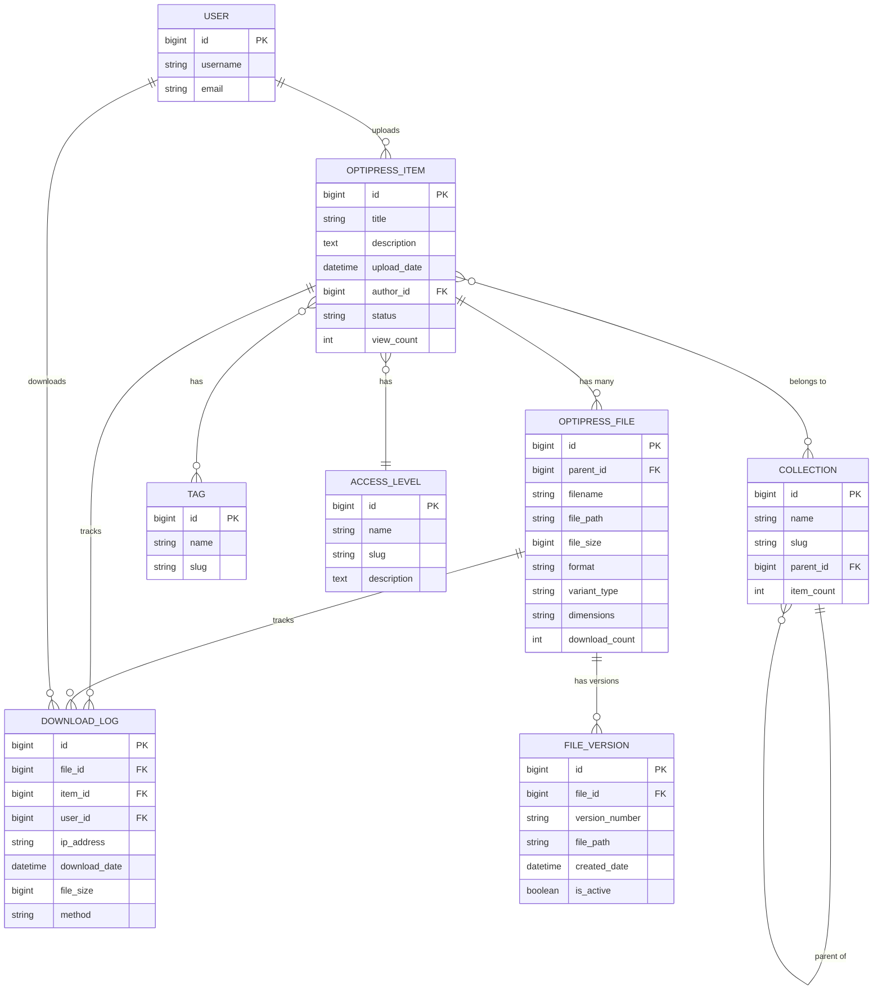
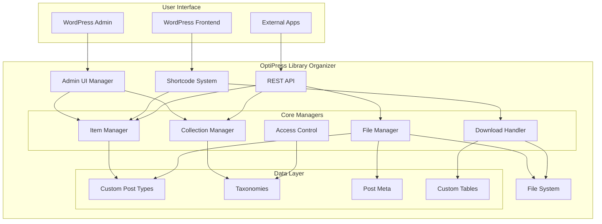
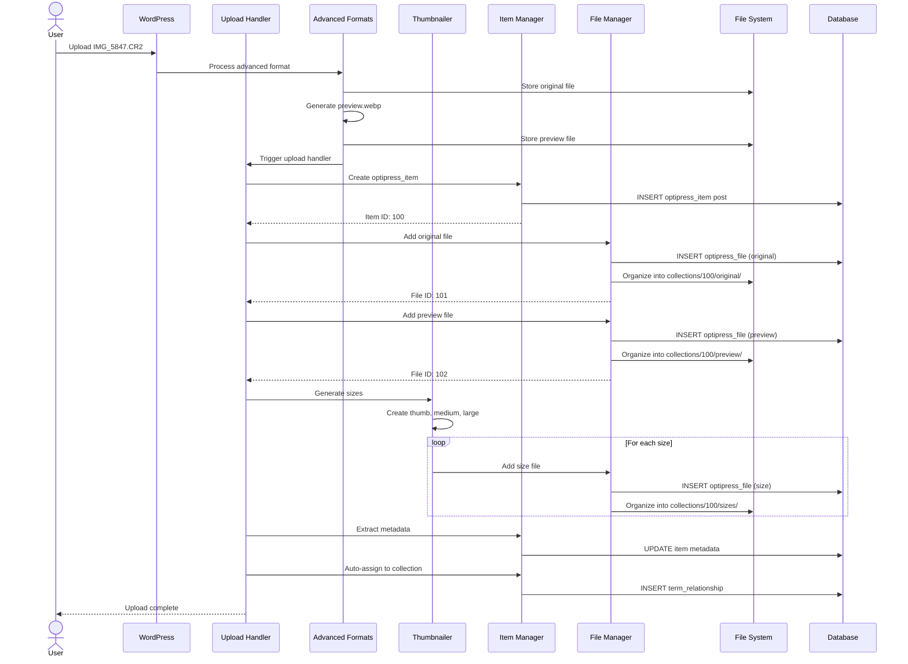
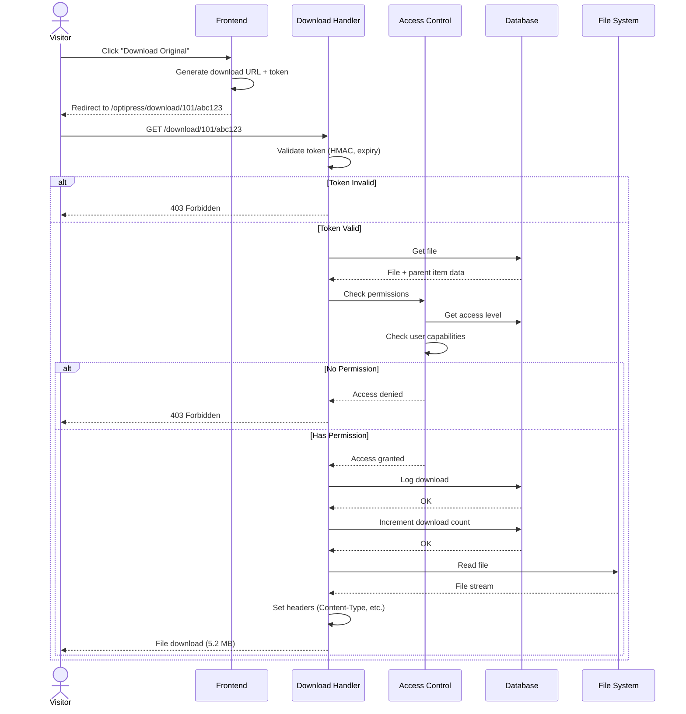
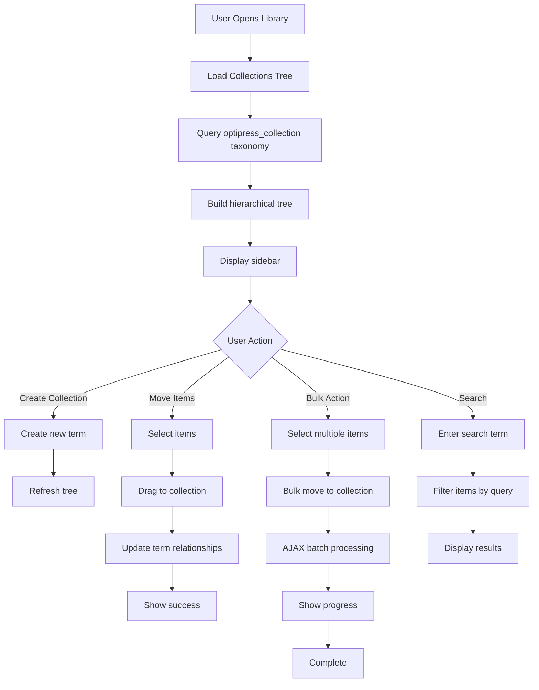
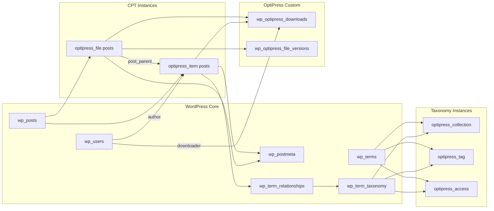
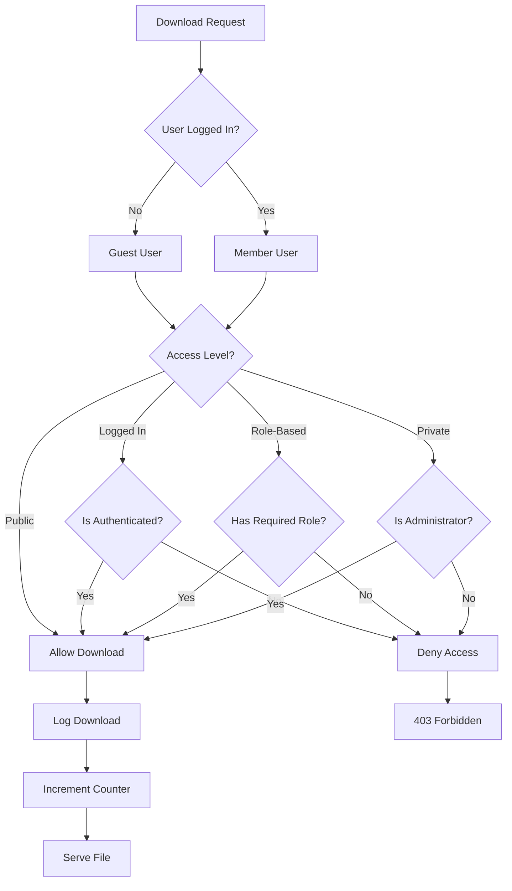

# OptiPress Library Organizer - Visual Diagrams

**Version**: 1.0
**Date**: 2025-10-01

## Entity Relationship Diagram (Mermaid)



---

## System Architecture (High-Level)



---

## Upload Flow Sequence



---

## Download Flow Sequence



---

## Collection Organization Flow



---

## Data Model (WordPress Integration)



---

## Access Control Decision Tree



---

## File System Organization

```
wp-content/uploads/optipress/
│
├── collections/
│   │
│   ├── 2025-portfolio/
│   │   ├── 100/                      ← Item ID
│   │   │   ├── original/
│   │   │   │   └── IMG_5847.CR2     (5.2 MB)
│   │   │   ├── preview/
│   │   │   │   └── preview.webp     (181 KB)
│   │   │   └── sizes/
│   │   │       ├── thumb-300x300.webp
│   │   │       ├── medium-1024x768.webp
│   │   │       └── large-2048x1536.webp
│   │   │
│   │   └── 101/
│   │       ├── original/
│   │       ├── preview/
│   │       └── sizes/
│   │
│   ├── client-work/
│   │   └── project-alpha/
│   │       └── 200/
│   │
│   └── uncategorized/
│       └── 150/
│
├── temp/
│   └── processing/           ← Temporary upload area
│
└── cache/
    └── thumbnails/           ← Admin thumbnail cache
```

---

## REST API Endpoints Map

```
/wp-json/optipress/v1/
│
├── items/
│   ├── GET    /              List all items (with filters)
│   ├── POST   /              Create new item
│   ├── GET    /{id}          Get single item
│   ├── PATCH  /{id}          Update item
│   ├── DELETE /{id}          Delete item
│   └── GET    /{id}/files    List files for item
│
├── files/
│   ├── POST   /              Upload new file
│   ├── GET    /{id}          Get file info
│   ├── PATCH  /{id}          Update file metadata
│   ├── DELETE /{id}          Delete file
│   ├── POST   /{id}/download Generate download URL
│   └── GET    /{id}/stats    Get download statistics
│
├── collections/
│   ├── GET    /              List all collections (tree)
│   ├── POST   /              Create collection
│   ├── GET    /{id}          Get single collection
│   ├── PATCH  /{id}          Update collection
│   ├── DELETE /{id}          Delete collection
│   └── GET    /{id}/items    Get items in collection
│
├── tags/
│   ├── GET    /              List all tags
│   ├── POST   /              Create tag
│   └── GET    /{id}/items    Get items with tag
│
└── stats/
    ├── GET    /downloads      Download statistics
    ├── GET    /popular        Most downloaded items
    └── GET    /recent         Recent activity
```

---

## Admin UI Layout (Library Page)

```
┌─────────────────────────────────────────────────────────────────┐
│ OptiPress → Library                                    [User ▼] │
├─────────────────────────────────────────────────────────────────┤
│                                                                   │
│ ┌────────────────┬───────────────────────────────────────────┐ │
│ │ Collections    │  Library Items                            │ │
│ │                │  ┌──────────────────────────────────────┐ │ │
│ │ 📂 All Items   │  │ 🔍 Search... [Filter ▼] [Sort ▼]    │ │ │
│ │   (1,234)      │  │                                       │ │ │
│ │                │  │ [+ Upload] [Bulk Actions ▼]          │ │ │
│ │ 📁 2025        │  └──────────────────────────────────────┘ │ │
│ │   📁 Portfolio │                                            │ │
│ │   │ 📁 Land... │  ┌─────┐ ┌─────┐ ┌─────┐ ┌─────┐         │ │
│ │   │ 📁 Port... │  │ IMG │ │ IMG │ │ IMG │ │ IMG │         │ │
│ │   │            │  │ 5847│ │ 5848│ │ 5849│ │ 5850│         │ │
│ │   📁 Work      │  │ CR2 │ │ NEF │ │ ARW │ │ TIFF│         │ │
│ │                │  │ 5.2M│ │ 6.1M│ │ 4.8M│ │ 8.3M│         │ │
│ │ 📁 Archive     │  └─────┘ └─────┘ └─────┘ └─────┘         │ │
│ │                │                                            │ │
│ │ [+ New]        │  ┌─────┐ ┌─────┐ ┌─────┐ ┌─────┐         │ │
│ │                │  │ IMG │ │ IMG │ │ IMG │ │ IMG │         │ │
│ │                │  │ 5851│ │ 5852│ │ 5853│ │ 5854│         │ │
│ │                │  └─────┘ └─────┘ └─────┘ └─────┘         │ │
│ │                │                                            │ │
│ │                │  Page 1 of 62          [Grid ▣] [List ☰] │ │
│ └────────────────┴───────────────────────────────────────────┘ │
│                                                                   │
└─────────────────────────────────────────────────────────────────┘
```

---

## Item Edit Page Layout

```
┌─────────────────────────────────────────────────────────────────┐
│ ← Back to Library                                 [Save Changes] │
├─────────────────────────────────────────────────────────────────┤
│                                                                   │
│ ┌──────────────────────┬────────────────────────────────────┐   │
│ │                      │ Edit Item: Sunset at Beach         │   │
│ │                      ├────────────────────────────────────┤   │
│ │   [Preview Image]    │                                     │   │
│ │                      │ Title: [Sunset at Beach_________]   │   │
│ │   2048 x 1365 px     │                                     │   │
│ │   preview.webp       │ Description:                        │   │
│ │   181 KB             │ [____________________________]      │   │
│ │                      │ [____________________________]      │   │
│ │ [View Full Size]     │                                     │   │
│ │                      │ Collections:                        │   │
│ └──────────────────────┤ ☑ 2025 Portfolio > Landscapes      │   │
│                        │ ☐ Client Work                       │   │
│ Files (5)              │                                     │   │
│ ┌──────────────────────┤ Tags:                               │   │
│ │ 📄 IMG_5847.CR2      │ [sunset] [beach] [HDR] [+Add]      │   │
│ │    Original          │                                     │   │
│ │    5.2 MB            │ Access Level:                       │   │
│ │    [Download] [Del]  │ (•) Public  ( ) Members  ( ) Private│   │
│ ├──────────────────────┤                                     │   │
│ │ 🖼️ preview.webp ⭐   │ Metadata:                           │   │
│ │    Preview           │ Camera: Canon EOS R5                │   │
│ │    181 KB            │ ISO: 400  f/2.8  1/500s            │   │
│ │    [Download] [Del]  │ Date: 2025-09-01 18:30             │   │
│ ├──────────────────────┤                                     │   │
│ │ 📐 thumb-300x300     │ Statistics:                         │   │
│ │    Thumbnail         │ Views: 245                          │   │
│ │    15 KB             │ Downloads: 15 (original)           │   │
│ │    [Download] [Del]  │ Last download: 2 hours ago         │   │
│ └──────────────────────┴────────────────────────────────────┘   │
│                                                                   │
│                                 [Delete Item] [Save Changes]     │
└─────────────────────────────────────────────────────────────────┘
```

---

**Status**: 📊 Visual Documentation Complete
**Last Updated**: 2025-10-01
**Purpose**: Visual aids for understanding system architecture
**Tools**: Mermaid.js diagrams (render in GitHub/GitLab/compatible viewers)
